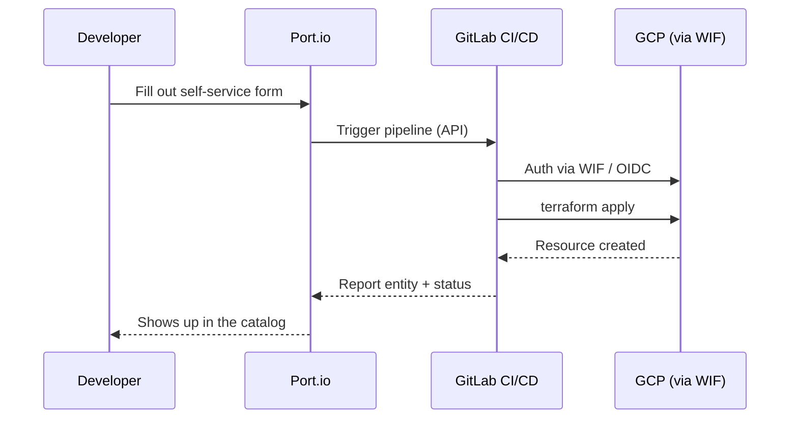

## Why bother

Every team eventually hits the moment where a developer needs a project, account, sub, or a bucket, or a pubsub, and the options are: file a ticket and wait three days, or DM the one person who knows the Terraform. Neither scales. So the developer does what developers do, which is find a way around you. They write a shell script. Then someone copies the shell script. Six months later you've got fourteen "projects" with no consistent IAM, no state backend anyone can find, and a bucket named `test-final-real` that's somehow in production.

That is the thing I actually built to prevent. Not a portal because portals are cool. A portal because the alternative is inheriting a pile of developer-grown provisioning tools that were never held to any standard, and then owning the cleanup.

This is the build: Port.io for the front door, GitLab CI/CD for the engine, Terraform for the work, and GCP Workload Identity Federation so there are no static keys floating around. I'll walk the architecture, then the part that cost me the most time, which was every GitLab behavior I assumed worked like GitHub and didn't.

## What's behind the door

Three self-service actions, each with its own Terraform module:

- GCS bucket provisioning, which was the first real resource I used to prove the pattern end to end
- GCP project provisioning, which is more than it sounds like and I'll get to that
- A resource bundle action for teams that want a project plus a starter kit in one request

The bucket action is the easy one to describe. Developer fills out a form in Port, Port fires a GitLab pipeline, the pipeline authenticates to GCP over OIDC through Workload Identity Federation, Terraform applies, and the result gets written back to Port as a catalog entity. No service account JSON sitting in a variable somewhere waiting to leak. If a GitLab token walks out the door, the blast radius is a scoped, short-lived federation, not the keys to a service account.

## The project action is a factory, not a form

Here's the piece I care about most, because it's where the "prevent the sprawl" thesis actually lives.

When someone requests a new GCP project, the action does not just run `terraform apply` against some central repo and call it done. It scaffolds a brand new Terraform repository for that project from a template. The action clones a template repo, stamps it with the project's identifiers and inputs, provisions the GitLab project, and wires up the Workload Identity Federation binding so that repo can authenticate to GCP on its own from day one.

The point of that is ownership with guardrails. Every project that comes out of this factory lands in the world with a real IaC home, a state backend that's configured the same way every time, a pipeline that already knows how to talk to GCP, and a module structure that matches every other project. The developer gets a repo they can actually work in. I get a fleet of projects that all look the same, because they were all pressed from the same die. Nobody is inventing their own layout, their own auth pattern, or their own idea of where state should live.

That is the whole game. Self-service without a template just moves the sprawl one layer up. Self-service from a template means the paved road is the only road, and you didn't have to police it.

## The GitLab tax nobody warns you about

I built the first rev of all this against a GitHub Actions backend, then moved it to GitLab. The Terraform didn't change. Almost everything around the Terraform did, in small ways that each looked like a bug in my code until I traced it. If you're coming from a GitHub shop, budget time for these four.

The trigger endpoint is not the obvious one. To kick a pipeline programmatically from Port, you want `POST /api/v4/projects/:id/pipeline`. There's also a `/trigger/pipeline` endpoint, it's real, it's documented, and it will take your call and do something that is not what you meant. If your Port action fires and either nothing runs or the wrong thing runs, start here.

Array inputs don't arrive as arrays. A Port form input typed as an array does not survive into a GitLab pipeline variable as one. You have to run it through `| tojson` so it deserializes on the far side. I lost a solid chunk of an afternoon certain my module was mishandling a list, when the truth was GitLab had handed the module a string cosplaying as a list.

Entity inputs hand you the whole object. When a Port input is `format: entity`, you get the entire entity back, not a tidy identifier. Pull `.identifier` off it before you feed it to Terraform. This one is sneaky because it'll pass a quick test when your object happens to carry a field that looks close enough, and then fall over the first time the shape shifts.

Conditional fields use `jqQuery`, not `dependsOn`. If you want a form field to appear only when another field has a certain value, the reflex is to reach for `dependsOn`. On Port that's the wrong lever. Conditional visibility runs off `visible.jqQuery`. Use `dependsOn` and the field simply never renders, and there's no error to tell you why.

None of these are anyone's fault. They're the toll you pay for carrying a mental model across CI systems and assuming the resemblance runs all the way down. It doesn't, and the resemblance is exactly what makes it expensive, because you don't think to check the things that look familiar.

## Was it worth it

Yes, and not because the Terraform is interesting. Terraform provisioning infrastructure is the least surprising sentence in this whole post. It was worth it because the output is a system where someone who has never opened a `.tf` file can get correct, consistent, auditable infrastructure, and where "correct and consistent" is enforced by the factory instead of by me reviewing everything by hand and losing.

If you're weighing whether to invest the time in a real IDP versus letting the current ticket-and-tribal-knowledge system limp along, this is the trade. Spend the week now building the paved road, or spend the next two years cleaning up the trails everyone cut through the grass while you weren't looking. I've done both. Build the road.

Next up is the Crossplane lab, where I take this same Port pattern and point it at Kubernetes-native resource claims, which changes a few assumptions once the thing you're provisioning lives inside the cluster instead of next to it.